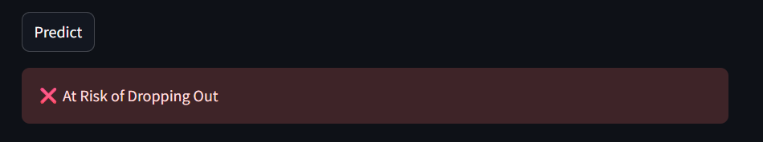

# 🎓 Student Dropout Prediction

This project is a machine learning application designed to predict whether a student is at risk of dropping out based on their academic performance, attendance, and personal background. It uses a trained model and is deployed as an interactive web application using Streamlit.

## 🚀 Demo

The app allows users to input student information and receive an instant prediction:


*Figure 1: Input form interface*


*Figure 2: Prediction result*

---

## 📁 Project Structure

```
student-dropout-prediction/
├── app.py                       # Streamlit frontend application
├── main.py                      # Script to train and save model
├── models/                      # Folder containing saved model and preprocessor
│   ├── best_model.pkl
│   ├── scaler.pkl
│   └── feature_columns.pkl
├── data/
│   └── student-mat.csv          # Dataset (from UCI Student Performance Dataset)
├── src/
│   └── data_preprocessing.py    # Feature engineering and preprocessing
├── screenshots/
│   ├── form.png
│   └── result.png
└── README.md                    # Project documentation
```

---

## ⚙️ How to Run

1. **Clone the repository**  
```bash
git clone https://github.com/ATOUIYakoub/student-dropout-prediction.git
cd student-dropout-prediction
```

2. **Create a virtual environment and activate it**  
```bash
python -m venv venv
.\venv\Scripts\activate   # On Windows
```

3. **Install dependencies**  
```bash
pip install -r requirements.txt
```

4. **Train the model**  
```bash
python main.py
```

5. **Launch the Streamlit app**  
```bash
streamlit run app.py
```

---

## 🧠 Model

The model is trained using:

- Preprocessing: One-hot encoding for categorical variables, standard scaling for numerical features.
- Model: Random Forest Classifier (you can change to XGBoost, SVM, etc.)
- Label: Students with G1 + G2 + G3 < 30 are labeled as likely to drop out.

---

## 📊 Dataset

- **Source**: UCI Machine Learning Repository
- **Link**: https://archive.ics.uci.edu/ml/datasets/Student+Performance
- **Attributes Used**: `G1`, `G2`, `age`, `studytime`, `absences`, `internet`, `sex`

---

## 👨‍💻 Authors

This project is developed as part of a machine learning assignment.

Feel free to contribute or fork it!

---
    